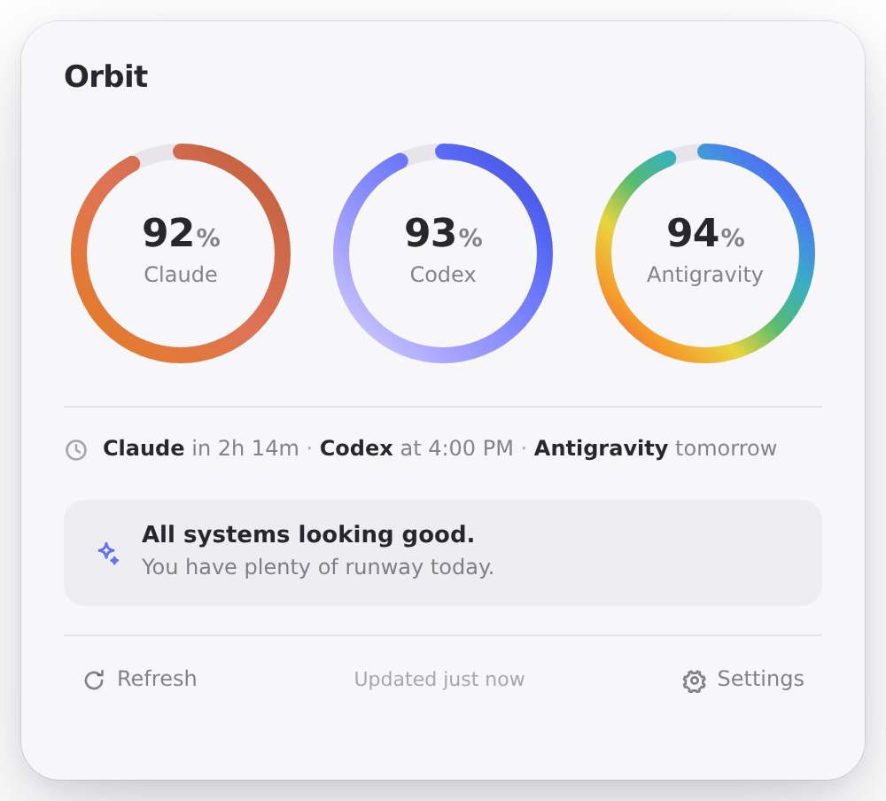
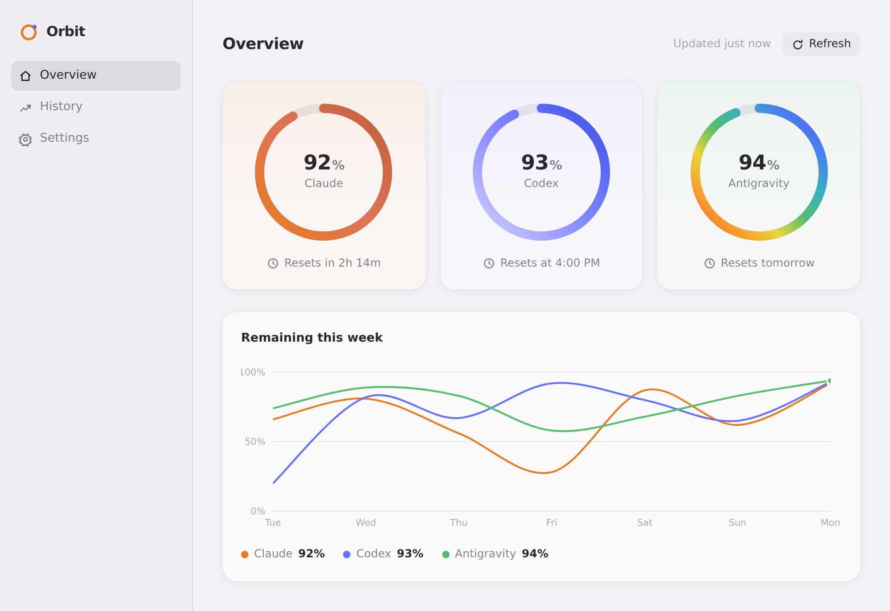
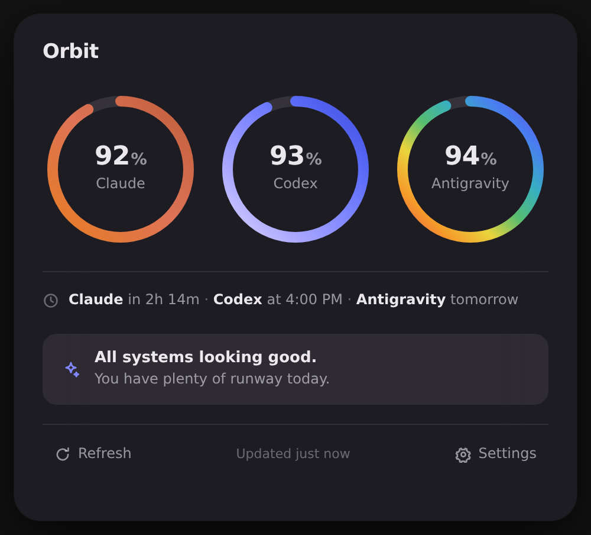
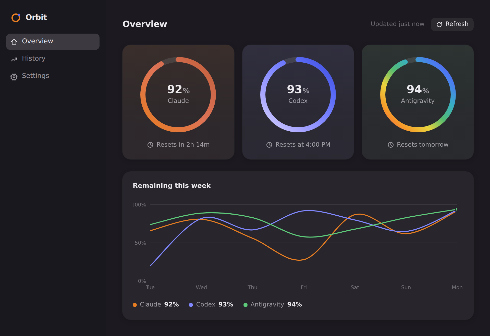

<div align="center">

# Orbit

**A calm, local-first desktop view of how much AI usage you have left.**

Orbit lives in your menu bar and answers one question at a glance:
*"How much Claude Code, OpenAI Codex, and Google Antigravity usage do I have left?"*

Built with Tauri 2 · React · TypeScript · Rust — no Electron, no backend, no cloud, no telemetry.

</div>

---

## Screenshots

| Tray panel | Main window |
| :--: | :--: |
|  |  |
|  |  |

> Captured from the browser preview (`npm run dev`); the desktop app adds native chrome, tray anchoring, and window translucency.

## Features

- **Menu bar / tray app** — click the tray icon for a compact floating panel with three usage rings, reset times, and a one-line status summary
- **Main window** — Overview (large rings + one restrained weekly chart), History (7 / 30 days), and Settings
- **Usage rings** — Apple-style activity rings: start at 12 o'clock, sweep clockwise, rounded caps, gradient strokes, spring-animated, exposed to assistive tech as meters
- **Demo Mode** — on by default; the whole product works with zero accounts (Claude 92 %, Codex 93 %, Antigravity 94 %)
- **Local persistence** — settings, snapshots, and 30 days of history stored on disk via `tauri-plugin-store`; nothing ever leaves your machine
- **Notifications** — a native notification when a service drops below your threshold, re-armed after it recovers
- **Launch at login** — via `tauri-plugin-autostart`, where the platform supports it
- **Light & dark** — follows the system appearance, with high-contrast and reduced-motion support

## Design

Orbit aims to feel like a native Apple utility:

- System font stack (SF Pro on macOS), tabular numerals, tight tracking on headings
- Translucent glass surfaces, soft layered shadows, generous spacing, rounded corners
- One accent per provider:
  - **Claude** — warm orange (`#E67D22 → #C15F3C`)
  - **Codex** — lavender→indigo (`#D7D4FF → #3F4DDA`)
  - **Antigravity** — spectrum (`#F0524D → #624FE3`)
- Subtle spring animations that respect `prefers-reduced-motion`

## Architecture

```
src/                     # React frontend (all product logic)
├── components/          # Reusable UI: UsageRing, GlassSurface, UsageChart,
│                        #   ChartCard, ProviderCard, SegmentedControl, Toggle,
│                        #   SettingsRow, StatusRow, SectionHeader, Button, icons
├── features/
│   ├── panel/           # Compact floating tray panel
│   ├── main/            # Main window shell (sidebar navigation)
│   ├── overview/        # Rings + weekly chart
│   ├── history/         # 7 / 30 day history
│   └── settings/        # Settings groups
├── providers/           # Usage-source abstraction
│   ├── demo.ts          #   DemoProvider (default experience)
│   ├── claude.ts        #   ClaudeProvider      — honest "unavailable" state
│   ├── codex.ts         #   CodexProvider       — honest "unavailable" state
│   └── antigravity.ts   #   AntigravityProvider — honest "unavailable" state
├── store/               # Zustand store: settings, snapshots, history
├── hooks/               # useAutoRefresh, useNow, useReducedMotion
├── lib/                 # time, persistence, notifications, autostart, tauri bridge
├── styles/              # Design tokens (color, type, spacing, motion) + base
└── types/               # Shared domain types

src-tauri/               # Rust shell (native affordances only)
└── src/lib.rs           # Tray icon + menu, panel toggle/anchor, window events
```

**Providers.** Every usage source implements one interface: `fetchUsage(): Promise<ProviderResult>`. A result is either an `ok` snapshot (percent remaining + reset time) or an honest `unavailable` state with a reason. None of the three services currently document a public usage API, so the live providers report exactly that rather than scraping undocumented endpoints — and Demo Mode is the primary experience. The interface is ready the day real integrations become possible.

**State.** A single Zustand store hydrates from disk, refreshes on a configurable interval, folds each snapshot into a per-day low-water-mark history (30 days retained), and persists through `tauri-plugin-store` (falling back to `localStorage` in a browser).

**Windows.** The Rust side owns the tray icon and two windows: `main` and the frameless, transparent `panel` anchored to the tray. The panel hides on blur; closing the main window keeps Orbit alive in the tray.

## Setup

Prerequisites:

- [Node.js](https://nodejs.org) ≥ 20 and npm
- [Rust](https://rustup.rs) (stable)
- Platform WebView dependencies — see the [Tauri prerequisites guide](https://v2.tauri.app/start/prerequisites/) (on Linux: `libwebkit2gtk-4.1-dev`, `libgtk-3-dev`, `libayatana-appindicator3-dev`, `librsvg2-dev`)

```sh
git clone https://github.com/beketovian/orbit.git
cd orbit
npm install
```

## Development

```sh
npm run tauri dev    # run the desktop app with hot reload
npm run dev          # browser-only preview (panel at /?window=panel)
npm test             # unit + component tests (Vitest)
npm run build        # typecheck + bundle the frontend
npm run tauri build  # production desktop build + installers
```

Regenerate the app icon (pure Node, no image dependencies):

```sh
node scripts/generate-icon.mjs && npm run tauri icon src/assets/icon-source.png
```

## Roadmap

- [ ] Real provider integrations as/when public usage APIs appear
- [ ] Per-provider notification thresholds
- [ ] Menu bar percentage title (macOS)
- [ ] Localization

## Contributing

Issues and pull requests are welcome. Keep changes small and focused, match the existing code style, add tests for logic, and use [Conventional Commits](https://www.conventionalcommits.org).

Guiding principle for any UI change: *would Apple ship this?*

## License

[MIT](LICENSE)
